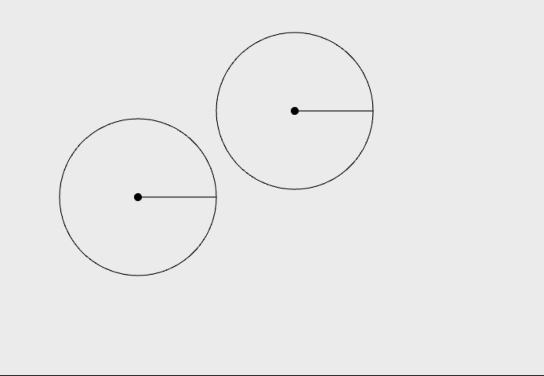
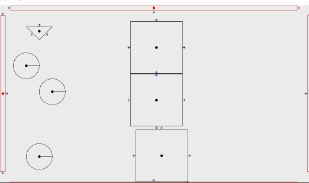
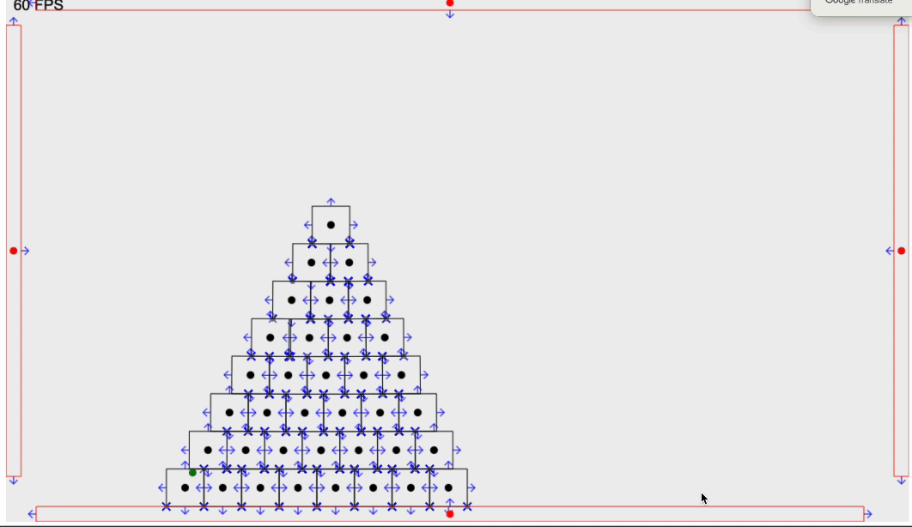
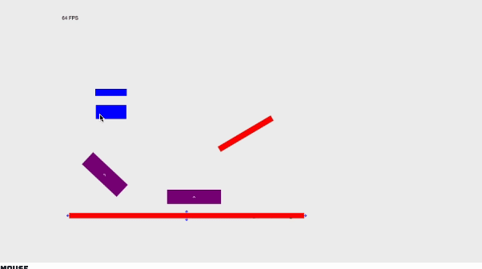
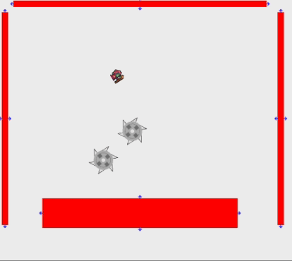

## Project Icarus

Icarus is a web game that applies interactions within a physics system. The game is currently under development, so please look forward to the final product!

## Physics Engine

1. making object

   - represent object with vectors
   - basic collision detection
   - positional correction to resolve collision

   

2. add boundness

   - add matter to object
   - collision resolve with boundness & friction

   

3. add rotational force

   - add rotational inertia to object
   - collision resolve with inertia & matter

   

## Fluid Engine

1. make particle based fluid

   - fluid action based with density
   - rust with web assembly

   

## Making Game

1. bacon game
   

2. pinball game
   
